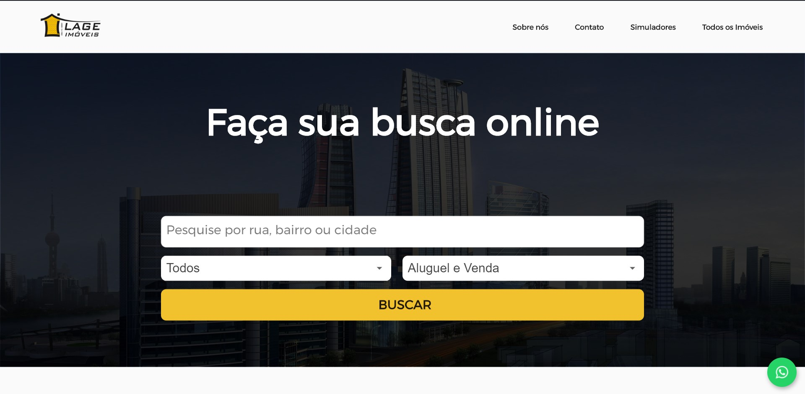
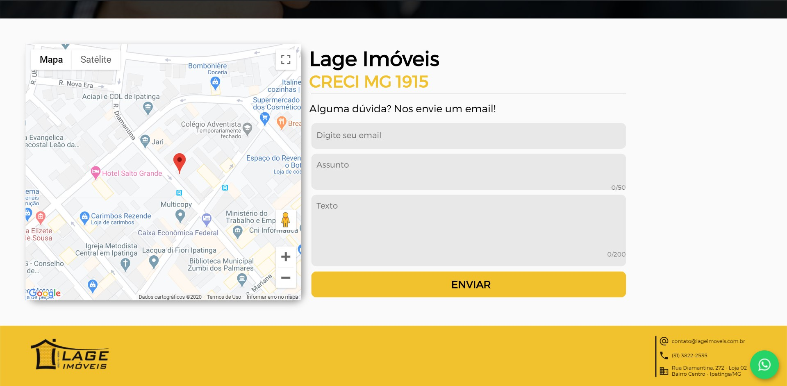
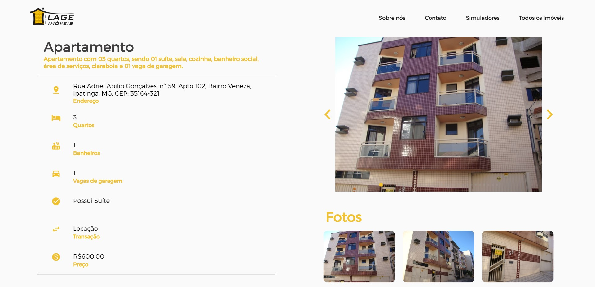
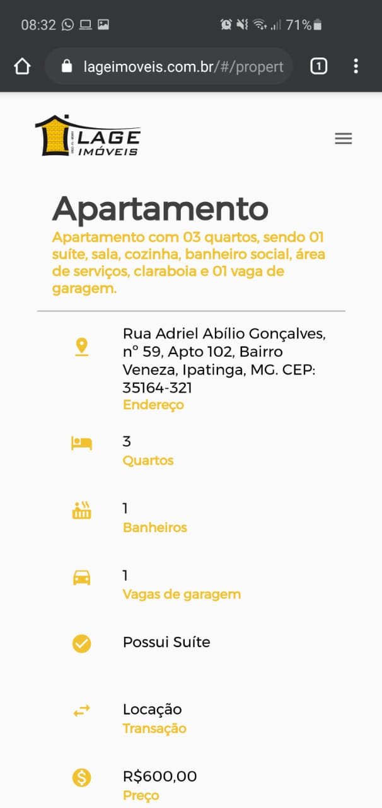

# 💡 Site LAGE IMÓVEIS

Site desenvolvido para a imobiliária Lage Imóveis. 
Disponível 
[neste link](https://lageimoveis.com.br)

## 📲 Tecnologias utilizadas 🖥

### Flutter Web
- Arquitetura MVC
- MOBX
- Responsive Layout Builder

## 📸 Imagens do sistema

<div style="text-align: center"><table><tr>
  <td style="text-align: center">
    
</td>
  <td style="text-align: center">
    
</td>
  <td style="text-align: center">
    
</td>
<td style="text-align: center">
    
</td>
<td style="text-align: center">
    
</td>
</tr></table></div>

## 👩‍💻 Para executar

```bash
flutter run -d chrome
```

## Licença
[MIT](https://choosealicense.com/licenses/mit/)